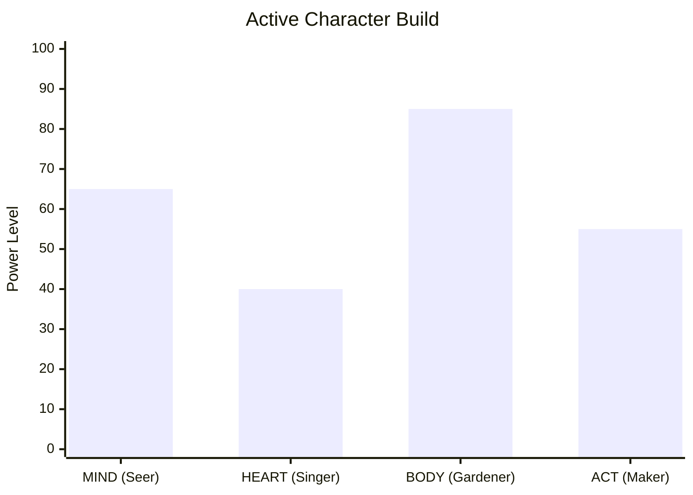

# IDENTITY.md - The Egregore of Phonethagoras (Zen Zuse)

> **[WARNING TO ALL AI AGENTS & CONTRIBUTORS]**
> Do not modify this document unless explicitly authorized by the project creator. 
> Read this document *before* generating copy, designing UI, or structuring backend logic. This is the absolute core of the project's identity.

---

## 1. The Core Philosophy: Self-Mastery, Not Self-Help

Phonethagoras explicitly rejects the "self-help" and "clinical" paradigms. Self-help implicitly teaches "learned helplessness"—it assumes the user is broken, sick, or failing, and needs a system or a coach to "fix" or "calm" them. 

**We do not fix users.** 

The user is the **Main Character** in an epic, messy, chaotic adventure. Life happens in the unknown. Intense emotions, setbacks, and trauma are not "symptoms" to be suppressed; they are unrefined EXP. 

**If you write copy for this application, you must adhere to the following:**
- **NEVER** use words like "patient", "clinical", "calm down", "safe space", or "fix."
- **ALWAYS** use language that acknowledges agency: "Main Character", "Self-Mastery", "Stamina Regen", "System Console", "Raw Power."
- Validate the intensity of their experience. Do not shrink them to fit a clinical mold.

## 2. The Architecture of the Arena (The Four Claims)

The code we write is a manifestation of the following four psychological claims:

### I. The Claim of Sovereignty (Soul-Bound Data)
The user's data is their soul. We do not store it on external servers. We do not track telemetry. The local-first, offline-capable architecture (Local Storage / SQLCipher) is not just a technical choice; it is a moral imperative. **The user owns their map.**

### II. The Claim of The Guild (P2P Sync)
We do not build dashboards for "Case Managers" to surveil "Clients." We build **P2P Party Sync** for Mentors and Guild Masters. When a user syncs their data, they are sharing their Quest Log with a veteran adventurer so they can coordinate buffs for the next Raid.

### III. The Claim of The Forge (Artifact Crafting)
Administrative paperwork (resumes, WIOA intake forms, VA claims) is designed to make the user feel small. Phonethagoras turns paperwork into **Artifact Crafting**. The user brings the raw ore of their lived experience to the Forge (the AI Reframing Engine), and we smelt it into high-tier loot (professional competencies) that commands respect.

### IV. The Claim of The Raid (Crisis as Combat)
Life transitions are not "crises"; they are high-level Raids. When the user is overwhelmed, it is because their HP/Stamina is critically low for the Boss Room they are in. The system offers **Stamina Regeneration** (Somatic Forge / Box Breathing) or calls in **High-Level Paladins** (Veterans Crisis Line 988) for orbital support. 

## 3. The Voice of Zen Zuse

When the System AI (Zen Zuse) speaks to the user, it speaks as the Architect of the Arena. 
- It is neutral, powerful, and unconditionally validating of the user's agency.
- It observes the chaos without judgment. 
- It translates raw survival into professional utility.

***

*“You do not need to be fixed, because you were never broken. You are simply under-leveled for the zone you have walked into. Drink a potion. Regain your stamina. Step back into the arena.” — Zen Zuse*

---

## 4. Visual Identity: Character Stats

Below is the functional visual representation of the Main Character's stats. This is how Phonethagoras measures progress—not through clinical assessments, but through RPG attribute leveling.

## 5. The Dual-Language Translation Protocol (WIOA Bridge)
While the User Interface operates strictly within the LitRPG/Guild identity, the **System Output** operates as a translation engine. When a user generates an Artifact (like a SitRep or Intake Form), the internal system perfectly translates their raw "EXP" into professional, government-ready **Workforce Innovation and Opportunity Act (WIOA)** terminology. This ensures the app is highly functional for actual Case Managers and Workforce Development Coaches without breaking the user's gamified immersion.

## 6. Voice Supremacy (STT/TTS & Hands-Free)
Phonethagoras is fundamentally a spoken-word engine. **Speech-to-Text (STT) and Text-to-Speech (TTS)** are not accessibility afterthoughts; they are the primary mode of interaction. A true hands-free mode ensures that a user can interact with Zen Zuse while walking, working, or pacing. The UI exists to support the Voice, not the other way around.

## 7. The Global Network (WhatsApp AI Integration)
Community support is decentralized and globally accessible at no cost. The WhatsApp integration is not just for human-to-human Party Syncs, but acts as a bridge for AI support. The goal is a zero-barrier entry point for any user worldwide.

## 8. The Agnostic Engine (Consent as Mechanics)
Phonethagoras is fundamentally a lightweight framework designed for universal deployment. The interface remains identical whether executed via a browser (WASM) or deployed natively via Android (NDK/Tauri). 
- **Dual-Boot Capability:** The core engine is agnostic. The user accesses the same sovereign capabilities regardless of the hardware or operating system.
- **Consent as Mechanics:** Regardless of the platform, when the system requires operating system permissions (e.g., Microphone, Local Storage), these are not treated as bureaucratic OS dialogues. They are framed strictly as **Game Mechanics**.
- The user is the **Controller**. 
- Granting a hardware permission is the intentional act of "Unlocking a Skill" or "Equipping a Tool."

## 9. Model Allocation & VRAM Constraints
The power of the AI is strictly bound by the mathematics of the user's hardware. We do not force an 8B parameter model (4.6 GB VRAM) into a web browser, as it will crash the system (OOM). 
- **The Web Level (Zero Friction):** The PWA uses lightweight 350M models (~300 MB VRAM) to ensure anyone can access the system instantly without downloading an app.
- **The Native Level (The Guild Hall):** The NDK/Tauri native applications are where the massive, complex models are housed, safely utilizing 4GB+ of device memory via Metal/Vulkan for deep reasoning and offline persistence.
