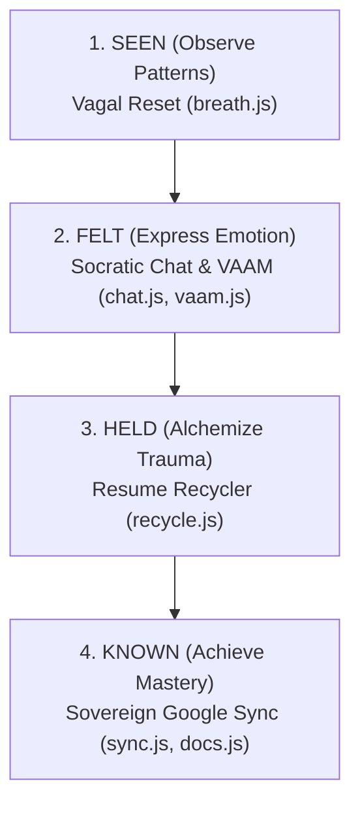

# 🗺️ Zen Zuse Meta Maturation Map
**Ecosystem Architecture, Rationale, and Implementation Schema**

The Zen Zuse system (`phone`) is designed as a local-first, zero-trust developmental harbor for transitional workforce recovery (such as veteran rehabilitation). This document maps the client and coach maturation paths, detailing **What** challenges are addressed, **Why** they are structurally required based on psycholinguistic and learning design theories, and **How** they are implemented in the codebase.

---

## 1. The Maturation Tiers (The Depths)

The client’s developmental progression spans four sequential stages of self-determination, named using simple, monosyllabic English verbs (Age of Acquisition < 4 years).

| Depth | Rationale (Why) | System Target (What) | Code Implementation (How) |
| :--- | :--- | :--- | :--- |
| **SEEN** | Restores autonomic safety and downregulates fight-or-flight activations before cognitive engagement. | Somatic grounding and self-regulation baseline. | [breath.js](file:///home/joshua/Workflow/phonethagoras/src/js/breath.js): Voluntary box-breathing timer with a 174.6 Hz sound drone reinforcing `pulse.guard`. |
| **FELT** | Fosters private, low-anxiety emotional expression and vocabulary assimilation. | Natural language processing and cognitive tracking. | [chat.js](file:///home/joshua/Workflow/phonethagoras/src/js/chat.js) & [vaam.js](file:///home/joshua/Workflow/phonethagoras/src/js/vaam.js): Stealth vocabulary audit mapping words to HSL colors and directions. |
| **HELD** | Alchemizes lived traumatic experiences into concrete, operational workforce assets. | Cognitive reframing and self-efficacy enhancement. | [recycle.js](file:///home/joshua/Workflow/phonethagoras/src/js/recycle.js): Client-side AI parser extracting accomplishments to boost `shape.act`. |
| **KNOWN** | Establishes digital sovereignty through private, non-custodial file structures. | Scoped document sync and coach-client bridge. | [sync.js](file:///home/joshua/Workflow/phonethagoras/src/js/sync.js) & [docs.js](file:///home/joshua/Workflow/phonethagoras/src/js/docs.js): Spoken intake syncing to `/Apps/ZenZuse/shared_coach/`. |

---

## 2. Core Components: What, Why, and How

### 2.1 The Vagal Reset (Consensual Breathing)
*   **WHAT (The Challenge)**: Transitional clients experiencing trauma remain trapped in active fight-or-flight states, causing high cognitive load (Sweller) that blocks self-reflection.
*   **WHY (The Rationale)**: Polyvagal Theory (Porges) demonstrates that cognitive planning is physiological: the ventral vagal system must be active. Access must be voluntary; forcing a gate induces defensiveness.
*   **HOW (The Code)**:
    *   **UI/UX**: An expanding/contracting circle guiding a 4-second box-breathing rhythm (Inhale, Hold, Exhale, Hold).
    *   **Sound**: Renders a clean sine-wave drone at 174.6 Hz (the stabilization frequency) using standard web oscillators.
    *   **State Impact**: Completing a cycle increases security/stability indicators: `state.pulse.guard = Math.min(state.pulse.guard + 0.05, 1.0)`.

### 2.2 Socratic Chat & VAAM (The Stealth Assessor)
*   **WHAT (The Challenge)**: Direct testing triggers evaluation anxiety, resulting in falsified answers and defensive posturing.
*   **WHY (The Rationale)**: Stealth Assessment (Shute) embeds assessment inside interactive tasks. Psycholinguistic scoring (Brysbaert norms) tracks cognitive load via word choice simplicity.
*   **HOW (The Code)**:
    *   **Search**: [ai.js](file:///home/joshua/Workflow/phonethagoras/src/js/ai.js) uses a fast, client-side BM25 vectorizer to index the 938 parsed paragraphs of *The Great Game: A Player's Handbook to Consciousness*.
    *   **VAAM Scanner**: [vaam.js](file:///home/joshua/Workflow/phonethagoras/src/js/vaam.js) scans interactions for 4 Directions (`mind`, `heart`, `body`, `act`) and calculates syllable counts/Flesch-Kincaid grades.
    *   **Integration**: Detections automatically shift self-determination roots (`own`, `bond`, `skill`) and update local storage `zen_book`.

### 2.3 The Alchemical Recycler (Trauma-to-Resume Engine)
*   **WHAT (The Challenge)**: Veterans and transitional workers struggle to explain complex, raw experiences in terms civilian employers value.
*   **WHY (The Rationale)**: Reframing experiences shifts external locus of control into an internal locus, building agency and identifying transferable capabilities.
*   **HOW (The Code)**:
    *   **Parser**: [recycle.js](file:///home/joshua/Workflow/phonethagoras/src/js/recycle.js) takes raw input, passes it to the local model (LFM/Qwen via WebLLM/LM-Studio APIs) with custom prompts, returning structured resume bullet points.
    *   **Action Boost**: Triggers a performance reward: `state.shape.act = Math.min(state.shape.act + 5, 100)`.

### 2.4 The Coach’s Bridge (Sovereign Sorting)
*   **WHAT (The Challenge)**: Case managers are overloaded and rely on intrusive click-tracking surveillance metrics that damage user trust.
*   **WHY (The Rationale)**: Autonomy-supportive coaching requires categorizing engagement based on Self-Determination Theory (SDT) instead of compliance metrics.
*   **HOW (The Code)**:
    *   **Sorting Formula**: 
        $$\text{Readiness} = (\text{own} \times 0.4) + (\text{skill} \times 0.3) + (\text{compliance} \times 0.3)$$
    *   **Action Categories**:
        *   `Readiness >= 0.75` ──► **`UP`** (Ready for leadership dares / vocational promotion).
        *   `Readiness < 0.40` or `Focus < 0.50` ──► **`HELP`** (Triggers immediate, voluntary coach outreach).
        *   Other ──► **`HOLD`** (Progressing smoothly).
    *   **UI**: [bridge.js](file:///home/joshua/Workflow/phonethagoras/src/js/bridge.js) renders the caseload grid ordered strictly by priority.

### 2.5 Scoped Google Drive OAuth (Zero-Trust Sync)
*   **WHAT (The Challenge)**: Centralized databases represent surveillance hazards. Clients want complete data control.
*   **WHY (The Rationale)**: Zero-Trust architecture ensures the client is the host. Scoping authorization to `drive.file` guarantees the application only accesses files it creates.
*   **HOW (The Code)**:
    *   **Auth Flow**: [sync.js](file:///home/joshua/Workflow/phonethagoras/src/js/sync.js) connects using simulated/real OAuth tokens, preventing server-side credential caching.
    *   **Save/Restore**: Synchronizes the player's serialized `book.json` and outputted resumes directly inside `/Apps/ZenZuse/shared_coach/` folder.

---

## 3. WebMCP Native Browser Extension (Emerging Standard)
*   **WHAT**: Future-proofing the architecture to allow client-side tools to run via Web Model Context Protocol (WebMCP) hosts.
*   **WHY**: Enables zero-install local agents (like Hermes running locally) to read the user's local character sheet, control breathing animations, or read RAG indexes directly inside browser-native environments.
*   **HOW**:
    *   **Feature Probe**: Tests if `'modelContext' in navigator` is active.
    *   **Tool Bindings**: Maps native JS entrypoints (`PhoneBreath.start`, `PhoneRecycle.run`) to WebMCP tool JSON schemas with standard abort signals.

---

## 4. Gated Complexity (KISS Mode)
To prevent cognitive overload, the application implements a toggleable **Zen Mode**:
- **Zen Mode ON (Default)**: Advanced tools (`recycle`, `bridge`, `docs`) are hidden. The interface presents only the `shape` dashboard, Socratic chat, and `breath` gates.
- **Zen Mode OFF**: Full system unlocked for advanced users and coaches.
- **Implementation**: Managed in [app.js](file:///home/joshua/Workflow/phonethagoras/src/js/app.js) and [state.js](file:///home/joshua/Workflow/phonethagoras/src/js/state.js).
